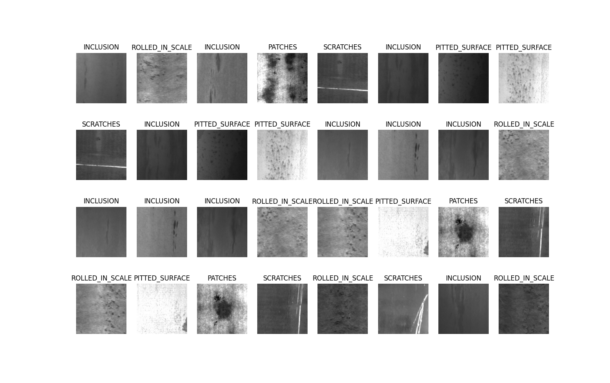
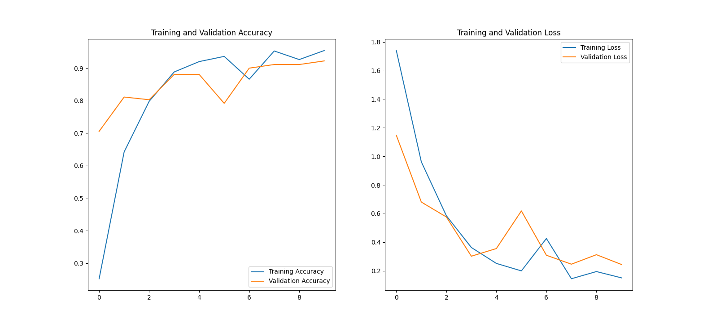

# Detecting Defects in Steel Using Tensorflow

## Data
### Source
The dataset that I used in this project is the Northeastern University (NEU) [surface defect database](http://faculty.neu.edu.cn/yunhyan/NEU_surface_defect_database.html).

I am not affiliated with NEU or the researchers who created this dataset, but I am grateful to Drs. Song and Yan for making this dataset available. Scroll to the bottom of this page to see examples of their work.

### Organization
This database consists of 1,800 square images of hot-rolled steel.
There are six defect categories:

1. rolled-in scale
2. patches
3. crazing
4. pitted surface
5. inclusion
6. scratches

Here is an example of what a training batch looks like:

Note that there are no images of steel *without defects* in this database. For the purposes of this demo, the model will only be trained to differentiate between defects.

## Instructions

### Step 1. Download the data
I did not want to host these images, as I do not own them. If you want to run the code yourself, download the NEU-CLS dataset [here](https://https://drive.google.com/open?id=1qrdZlaDi272eA79b0uCwwqPrm2Q_WI3k).

The database is a zipped archive, with IMAGES and ANNOTATIONS subdirectories. Simply unzip the directory somewhere, and copy the absolute path to the IMAGES subdirectory. For example, I extracted the directory in my Documents folder (on Windows 10), and the path I copied was:
`C:\Users\User\Documents\data\NEU-DET\IMAGES`

### Step 2. Clone this repo and activate the virtual environment
I recommend using [pipenv](https://pypi.org/project/pipenv/). In the project root folder, you can activate the environment with this command: 
`pipenv install` 
`pipenv shell`

### Step 3. Run setup.py to set up the database for training
This script has one required argument, which is the path copied from Step 1. For example, in my case this worked using Windows 10 Powershell: 
`python setup.py C:\Users\User\Documents\data\NEU-DET\IMAGES`

This script reorganizes the IMAGES directory so that the classes are put into separate sub-directories. This is done so that we can use convenience methods in Keras for loading the data.

### Step 4. Run main.py to build and train the model
This is where the majority of the work happens. As with setup.py, you must pass in the path to the IMAGES directory. 
`python main.py C:\Users\User\Documents\data\NEU-DET\IMAGES`

If all goes well, plots of accuracy and loss will be displayed for the training and validation sets, like so...

***

## Related research from the authors of the database (not me)
K. Song and Y. Yan, “A noise robust method based on completed local binary patterns for hot-rolled steel strip surface defects,” Applied Surface Science, vol. 285, pp. 858-864, Nov. 2013.

Yu He, Kechen Song, Qinggang Meng, Yunhui Yan, “An End-to-end Steel Surface Defect Detection Approach via Fusing Multiple Hierarchical Features,” IEEE Transactions on Instrumentation and Measuremente,  2020,69(4),1493-1504.

Hongwen Dong, Kechen Song, Yu He, Jing Xu, Yunhui Yan, Qinggang Meng, “PGA-Net: Pyramid Feature Fusion and Global Context Attention Network for Automated Surface Defect Detection,” IEEE Transactions on Industrial Informatics,  2020.
